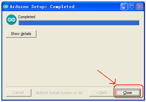
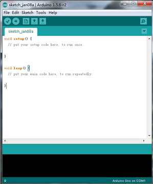
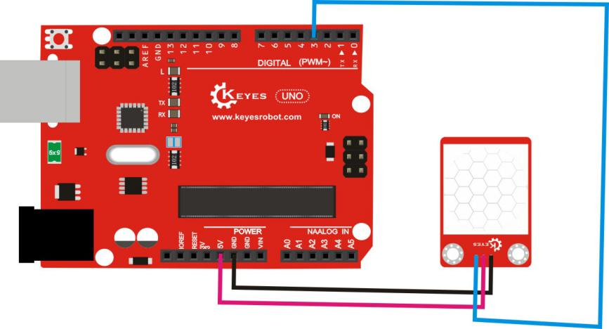

# 3、Arduino

# 3.1、Arduino IDE和驱动的安装

当我们拿到开发板时，首先我们要安装Arduino IDE和驱动，相关文件我们可以在官网上找到，以下链接是包含各种系统、各种版本的Arduino IDE和驱动任你选择。

<https://www.arduino.cc/en/Main/OldSoftwareReleases#1.5.x>

下面我们介绍下Arduino-1.5.6 版本IDE在Windows系统的安装方法。

下载下来的文件是一个arduino-1.5.6-r2-windows.zip的压缩文件夹，解压出来到硬盘。

双击Arduino-1.5.6 .exe文件

然后

然后

等待安装完成.点击close，安装完成。

1.5.6版本安装后的样子。

接下来是开发板驱动的安装，这次我们安装的是Keyes UNO R3
开发板的驱动，Keyes 2560 R3
开发板安装驱动方法和这个类似，驱动文件可以用同一个文件。

不同的系统，安装驱动的方法也有一些细小的区别，下面我们介绍在WIN 7系统安装驱动的方法。

第一次Keyes UNO R3
开发板连接电脑时，点击计算机--属性--设备管理器，显示如下图。

点击 Unknown device 安装驱动，如下图。

进入下图，选择

找到Arduino安装位置的drivers文件夹

点击“Next”，今天下图选择，开始安装驱动

安装驱动完成，出现下图点击Close。

这样驱动就装好了。点击计算机--属性--设备管理器，我们可看见如下图。

# 3.2、Arduino IDE的使用方法

Keyes UNO R3
开发板的USB驱动安装成功之后，我们可以在Windows设备管理器中找到相应的串口。

下面示范第一个程序的烧写，串口监视器中显示“Hello World！”。

测试代码为：

int val;

int ledpin=13;

void setup()

{

Serial.begin(9600);

pinMode(ledpin,OUTPUT);

}

void loop()

{

val=Serial.read();

if(val=='R')

{

digitalWrite(ledpin,HIGH);

delay(500);

digitalWrite(ledpin,LOW);

delay(500);

Serial.println("Hello World!");

}

}

我们打开Arduino 的软件，编写一段程序让Keyes UNO R3
开发板接受到我们发的指令就显示“Hello World！”字符串；我们再借用一下Keyes UNO R3 开发板上的 D13
的指示灯，让Keyes UNO R3
开发板接受到指令时指示灯闪烁一下，再显示“Hello World！”。

打开Arduino 的软件，设置板，如下。

设置COM端口，如下

点击编译程序，检查程序是否错误；点击上传程序；Keyes UNO R3 开发板设置OK后右下脚显示如下图，和设备管理器中显示一致。

上传成功，输入R，点击发送，Keyes UNO R3 开发板上的 D13
的指示灯闪烁一次，串口监视器中显示 Hello World! 如下图

那么恭喜你，你的第一个程序已经成功了！！！

# 3.3、实验课程

## 实验一 LED 闪烁实验

实验说明

LED 闪烁实验是比较基础的实验之一，上一个“ Hello World！”实验里已经利用到了Arduino 自带的LED，这次我们利用其他I/O
口和外接直插LED 灯来完成这个实验。

实验器材

开发板*1

USB线*1

LED*1

220Ω 电阻*1

面包板*1

面包板连接线若干

接线图

测试代码

int led = 2; //定义数字口2

void setup()

{

  pinMode(led, OUTPUT);     //设置led为输出

}

void loop()

{

  digitalWrite(led, HIGH);   //开启led

  delay(1000); //延迟1秒

  digitalWrite(led, LOW);    //关闭led

  delay(1000);//延迟1秒

}

测试结果

下载完程序就可以看到我们的IO口外接小灯在闪烁了，这样我们的实验现象为LED不停闪烁，间隔大约为1秒。

## 实验二 呼吸灯实验

实验说明

上一课程中我们只是控制LED的亮和灭，那么我们可以怎么控制LED的亮度呢？本课程中我们把LED接到PWM口中，然后通过改变PWM数值，调节LED亮度，使LED逐渐变亮，和逐渐变暗，从而达到呼吸灯的效果。

实验器材

开发板*1

USB线*1

LED*1

220Ω 电阻*1

面包板*1

面包板连接线若干

接线图

测试代码

int ledPin = 3; // 定义数字口3

void setup()

{

pinMode(ledPin, OUTPUT);// 将ledPin设置为输出

}

void loop()

{

for (int a=0; a\<=255;a++)// 设置使LED逐渐变亮

{

analogWrite(ledPin,a); //
开启led,调节亮度，范围是0-255，在255时led最亮

delay(10); // 延迟0.01S

}

for (int a=255; a\>=0;a--) // 设置使LED逐渐变暗

{

analogWrite(ledPin,a); //
开启led,调节亮度，范围是0-255，在255时led最亮

delay(10); // 延迟0.01秒

}

delay(1000);// 延迟1秒

}

测试结果

下载完程序就可以看到我们的IO口外接小灯显示出呼吸灯的效果，小灯先逐渐变亮，后逐渐变暗，循环交替。

## 实验三 广告灯实验

实验说明

在生活中我们经常会看到一些由各种颜色的led灯组成的广告牌，广告牌上各个位置上癿led灯不断的变话,形成各种效果。本节实验就是利用led灯编程模拟广告灯效果。

实验器材

开发板*1

USB线*1

LED\*5

220Ω 电阻\*5

面包板*1

面包板连接线若干

接线图

测试代码

int BASE = 2 ; //第一个 LED 接的 I/O 口

int NUM = 5; //LED 的总数

void setup()

{

for (int i = BASE; i \< BASE + NUM; i ++)

{

pinMode(i, OUTPUT); //设定数字I/O口为输出

}

}

void loop()

{

for (int i = BASE; i \< BASE + NUM; i ++)

{

digitalWrite(i, HIGH); //设定数字I/O口输出为"高"，即逐渐开灯

delay(200); //延迟

}

for (int i = BASE; i \< BASE + NUM; i ++)

{

digitalWrite(i, LOW); //设定数字I/O口输出为"低"，即逐渐关灯

delay(200); //延迟

}

}

测试结果

下载完程序就可以看到我们的IO口外接小灯先逐渐变亮，然后逐渐变暗，循环交替。

## 实验四 交通灯实验 

实验说明

前面我们已经完成了单个小灯的控制实验，接下来我们就来做一个稍微复杂一点的交通灯实验，其实聪明的朋友们可以看出来这个实验就是将上面单个小灯的实验扩展成3
个颜色的小灯，就可以实现我们模拟交通灯的实验了。

实验器材

红色LED*1

黄色LED*1

绿色LED*1

220Ω电阻\*3

面包板*1

面包板连接线若干

接线图

测试代码

int redled =10; //定义数字10 接口

int yellowled =7; //定义数字7 接口

int greenled =4; //定义数字4 接口

void setup()

{

pinMode(redled, OUTPUT);//定义红色小灯接口为输出接口

pinMode(yellowled, OUTPUT); //定义黄色小灯接口为输出接口

pinMode(greenled, OUTPUT); //定义绿色小灯接口为输出接口

}

void loop()

{

digitalWrite(greenled, HIGH);////点亮 绿灯

delay(5000);//延时5秒

digitalWrite(greenled, LOW); //熄灭 绿灯

for(int i=0;i\<3;i++)//闪烁交替三次，黄灯闪烁效果

{

delay(500);//延时0.5 秒

digitalWrite(yellowled, HIGH);//点亮 黄灯

delay(500);//延时0.5 秒

digitalWrite(yellowled, LOW);//熄灭 黄灯

}

delay(500);//延时0.5 秒

digitalWrite(redled, HIGH);//点亮 红灯

delay(5000);//延时5 秒

digitalWrite(redled, LOW);//熄灭 红灯

}

测试结果

按照接线图接好线，上传完程序，上电后，我们就可以看到我们自己设计控制的交通灯了。实验效果为绿灯亮5秒，绿灯熄灭，黄灯循环闪烁3次，红灯亮5秒，依次循环。

## 实验五 按键控制LED实验

实验说明

I/O 口的意思即为INPUT 接口和OUTPUT
接口，到目前为止我们设计的小灯实验都还只是应用到Arduino 的I/O
口的输出功能，这个实验我们来尝试一下使用Arduino的I/O
口的输入功能即为读取外接设备的输出值，我们用一个按键和一个LED
小灯完成一个输入输出结合使用的实验，让大家能简单了解I/O 的作用。

实验器材

开发板 *1

USB线*1

LED*1

轻触按键*1

220Ω 电阻*1

10KΩ 电阻*1

面包板*1

面包板连接线若干

接线图

测试代码

int ledPin = 11; //定义数字口11

int inputPin = 3; //定义数字口3

void setup()

{

pinMode(ledPin, OUTPUT); //将ledPin设置为输出

pinMode(inputPin, INPUT); //将inputPin设置为输入

}

void loop()

{

int val = digitalRead(inputPin);

//设置数字变量val，读取到数字口3的数值，并赋值给 val

if (val == LOW) //当val为低电平时，LED变暗

{

digitalWrite(ledPin, LOW); // LED变暗

}

else

{

digitalWrite(ledPin, HIGH); // LED亮起

}

}

测试结果

下载完程序，上电后，当按键按下时小灯亮起，否则小灯不亮。

## 实验六 抢答器实验

实验说明

完成上面的实验以后相信已经有很多朋友可以独立完成这个实验了，我们可以将上面的按键控制小灯的实验扩展成4个按键对应3
个小灯，占用7个数字I/O
接口。为方便接线，我们把3个小灯用一个RGB灯代替。RGB灯可通过 R、 G、
B三个引脚的PWM电压输入可以调节三种基色（红/蓝/绿）的强度从而实现全彩的混色效果。

本实验中我们利用4个按键控制3个PWM口，控制RGB模块发光颜色从而达到抢答器的效果。RGB灯接口说明如下图。

实验器材

开发板*1

USB线*1

RGB灯*1

轻触按键\*4

10KΩ 电阻\*4

220Ω 电阻*1

面包板*1

面包板连接线若干

杜邦线若干

接线图

测试代码

int redled=9;

int greenled=10;

int blueled=11;

int redpin=5;

int greenpin=4;

int bluepin=3;

int restpin=2;

int red;

int green;

int blue;

void setup()

{

pinMode(redled,OUTPUT);

pinMode(greenled,OUTPUT);

pinMode( blueled,OUTPUT);

pinMode(redpin,INPUT);

pinMode(greenpin,INPUT);

pinMode(bluepin,INPUT);

}

void loop()

{

red=digitalRead(redpin);

green=digitalRead(greenpin);

blue=digitalRead(bluepin);

if(red==LOW)RED_YES();

if(green==LOW)GREEN_YES();

if(blue==LOW)BLUE_YES();

}

void RED_YES()

{

while(digitalRead(restpin)==1)

{

color(255, 0, 0);

}

clear_led();

}

void GREEN_YES()

{

while(digitalRead(restpin)==1)

{

color(0, 255, 0);

}

clear_led();

}

void BLUE_YES()

{

while(digitalRead(restpin)==1)

{

color(0, 0, 255);

}

clear_led();

}

void clear_led()

{

color(0, 0, 0);

}

void color (unsigned char red, unsigned char green, unsigned char blue) //颜色控制函数

{

analogWrite(redled, 255-red);

analogWrite(greenled,255-green);

analogWrite(blueled, 255-blue);

}

测试结果

下载完程序，上电后，一个简单的抢答器就做好了，我们根据RGB灯显示的颜色判断是谁抢答成功。在复位后。RGB灯关闭。

## 实验七 滚珠开关控制LED灯

实验说明

滚珠开关也就是倾斜开关，它的工作原理是当开关一端低于水平位置倾斜，开关寻通；当另一端低于水平位置倾斜
，开关停止。这个实验中滚珠开关提供数字信号，然后控制一个LED灯的亮灭。

实验器材

开发板*1

USB线*1

LED*1

倾斜开关*1

220Ω 电阻*1

10KΩ 电阻*1

面包板*1

面包板连接线若干

接线图

测试代码

int ledPin = 6; //定义数字口6

int inputPin = 7; //定义数字口7

void setup()

{

pinMode(ledPin, OUTPUT); //将ledPin设置为输出

pinMode(inputPin, INPUT); //将inputPin设置为输入

}

void loop()

{

int val = digitalRead(inputPin);

//设置数字变量val，读取到数字口7的数值，并赋值给 val

if (val == LOW) //当val为低电平时，LED变暗

{

digitalWrite(ledPin, LOW); // LED变暗

}

else

{

digitalWrite(ledPin, HIGH); // LED亮起

}

}

测试结果

按照上图接好线，烧录好代码，上电后，通过倾斜开关可控制一个LED的亮灭，倾斜一一边LED亮起，倾斜另一边，LED熄灭。

## 实验八 电位器调控灯光亮度实验

实验说明

在第二课程中我们直接通过PWM口控制灯的亮度，从而达到呼吸灯的效果。在这课程中我们通过一个电位器，利用电位器调节PWM值，从而控制灯的亮度。

实验器材

开发板*1

USB线*1

LED*1

220Ω 电阻*1

可调电位器*1

面包板*1

面包板连接线若干

接线图

测试代码

int ledpin=11;//定义数字接口11（PWM 输出）

void setup()

{

pinMode(ledpin,OUTPUT);//定义数字接口11 为输出

Serial.begin(9600);//设置波特率为9600

}

void loop()

{

int val=analogRead(0);//读取模拟口A0口的值

val = map(val, 0, 1023, 0, 255);//从0-1023映射到0-255

Serial.println(val);//显示val 变量

analogWrite(ledpin,val);// 打开LED 并设置亮度

delay(100);//延时0.1 秒

}

测试结果

下载完程序后。我们可以通过旋转可调电位器控制小灯的亮度，打开串口监视器，设置波特率为9600，就可看到调节LED亮度的PWM值。

## 实验九 有源蜂鸣器实验

实验说明

蜂鸣器可分为有源蜂鸣器和无源蜂鸣器两种。本课程中主要用到了有源蜂鸣器，有源蜂鸣器内部有一简单的振荡电路，能将恒定的直流电转化成一定频率的脉冲信号。实验中中我们只需要给蜂鸣器输入一个高电平信号，蜂鸣器响起。

实验器材

开发板*1

USB线*1

有源蜂鸣器*1

面包板*1

面包板连接线若干

接线图

测试代码

int buzzer = 2; //定义数字口2

void setup()

{

  pinMode(buzzer, OUTPUT);     //设置buzzer为输出

}

void loop()

{

  digitalWrite(buzzer, HIGH);   //开启buzzer

  delay(1000); //延迟1S

  digitalWrite(buzzer, LOW);    //关闭buzzer

  delay(1000);//延迟1S

}

测试结果

下载完程序后，我们可以听到蜂鸣器响1秒，停止响起1秒，循环交替。

## 实验十 感光灯实验

实验说明

完成以上的各种实验后，我们对Arduino
的应用也应该有一些认识和了解了，在基本的数字量输入输出和模拟量输入以及PWM
的产生都掌握以后，我们就可以开始进行一些传感器的应用了。

本次实验我们先进行一个较为简单的光敏电阻的使用实验。光敏电阻既然是可以根据光强改变阻值的元件，自然也需要模拟口读取模拟值了，本实验可以借鉴电位器调控灯光亮度实验，将电位计换做光敏电阻实现当光强不同时LED
小灯的亮度也会有相应的变化。

实验器材

开发板*1

USB线*1

LED*1

220Ω 电阻*1

10KΩ 电阻*1

光敏电阻*1

面包板*1

面包板连接线若干

接线图

测试代码

int ledpin=11;//定义数字接口11（PWM 输出）

void setup()

{

pinMode(ledpin,OUTPUT);//定义数字接口11 为输出

Serial.begin(9600);//设置波特率为9600

}

void loop()

{

int val=analogRead(0);//读取模拟口A0口的值

Serial.println(val);//显示val 变量

val = map(val, 0, 1023, 0, 255);//从0-1023映射到0-255

analogWrite(ledpin,255-val);// 打开LED 并设置亮度

delay(10);//延时0.01 秒

}

测试结果

下载完程序后，光敏电阻感应到灯光越亮，小灯越暗；光敏电阻感应到灯光越暗，小灯越亮。打开串口监视器，设置波特率为9600，就可看到光敏电阻感应到外界光强所得的模拟值。

## 实验十一 红外遥控器实验

实验说明

红外遥控器发出的信号是一连串的二进制脉冲码。为了使其在无线传输过程中免受其他

红外信号的干扰,通常都是先将其调制在特定的载波频率上,然后再经红外发射二极管发

射出去,而红外线接收装置则要滤除其他杂波,叧接收该特定频率的信号并将其还原成二

进制脉冲码,也就是解调.

实验中我们用一个红外遥控和一个红外接收头控制6个LED灯的亮和灭。实验前，我们

要对红外遥控进行解码。

实验器材

开发板*1

USB线*1

红外遥控*1

红外接收 VS1838B*1

红色LED\*6

220Ω 电阻\*6

面包板*1

面包板连接线若干

接线图

红外解码接线

红外控灯实验接线

测试代码

红外解码

\#include \<IRremote.h\>

int RECV_PIN = 11; //define input pin on Arduino

IRrecv irrecv(RECV_PIN);

decode_results results;

void setup()

{

Serial.begin(9600);

irrecv.enableIRIn(); // Start the receiver

}

void loop() {

if (irrecv.decode(&results)) {

Serial.println(results.value, HEX);

irrecv.resume(); // Receive the next value

}

}

红外控灯实验

\#include \<IRremote.h\>

int RECV_PIN = 11;

int LED1 = 2;

int LED2 = 3;

int LED3 = 4;

int LED4 = 5;

int LED5 = 6;

int LED6 = 7;

long on1 = 0x00FF6897;

long off1 = 0x00FF9867;

long on2 = 0x00FFB04F;

long off2 = 0x00FF30CF;

long on3 = 0x00FF18E7;

long off3 = 0x00FF7A85;

long on4 = 0x00FF10EF;

long off4 = 0x00FF38C7;

long on5 = 0x00FF5AA5;

long off5 = 0x00FF42BD;

long on6 = 0x00FF4AB5;

long off6 = 0x00FF52AD;

IRrecv irrecv(RECV_PIN);

decode_results results;

void setup()

{

pinMode(RECV_PIN, INPUT);

pinMode(LED1, OUTPUT);

pinMode(LED2, OUTPUT);

pinMode(LED3, OUTPUT);

pinMode(LED4, OUTPUT);

pinMode(LED5, OUTPUT);

pinMode(LED6, OUTPUT);

irrecv.enableIRIn(); // Start the receiver

}

int on = 0;

unsigned long last = millis();

void loop()

{

if (irrecv.decode(&results))

{

// If it's been at least 1/4 second since the last

// IR received, toggle the relay

if (millis() - last \> 250)

{

on = !on;

}

if (results.value == on1 )

digitalWrite(LED1, HIGH);

if (results.value == off1 )

digitalWrite(LED1, LOW);

if (results.value == on2 )

digitalWrite(LED2, HIGH);

if (results.value == off2 )

digitalWrite(LED2, LOW);

if (results.value == on3 )

digitalWrite(LED3, HIGH);

if (results.value == off3 )

digitalWrite(LED3, LOW);

if (results.value == on4 )

digitalWrite(LED4, HIGH);

if (results.value == off4 )

digitalWrite(LED4, LOW);

if (results.value == on5 )

digitalWrite(LED5, HIGH);

if (results.value == off5 )

digitalWrite(LED5, LOW);

if (results.value == on6 )

digitalWrite(LED6, HIGH);

if (results.value == off6 )

digitalWrite(LED6, LOW);

last = millis();

irrecv.resume(); // Receive the next value

}

}

注意：在上传程序前，要把IRremote 文件夹放到
编译器安装目录下的\Arduino\libraries里。不然编译不过。

例如我的：C:\Program Files\Arduino\libraries

测试结果

按照接线图接好线，上传好代码，上电后，红外解码时，红外遥控对准红外接收头按下按键，即可在Arduino IDE的串口监视器中看到对应的编码，详细编码如下图。

红外控灯实验时，我们将遥控器对准红外接收头，按下1 2 3 4 5 6 7 8 9 \* 0
\#共12个按键就可控制6个LED灯的亮与灭。

## 实验十二 一位数码管显示实验

实验说明

数码管是一种半导体发光器件，其基本单元是发光二极管。数码管按段数分为七段数码管和八段数码管，八段数码管比七段数码管多一个发光二极管单元（多一个小数点显示），本实验所使用的是八段数码管。数码管共有七段显示数字的段，还有一个显示小数点的段。当让数码管显示数字时，只要将相应的段点亮即可。

实验器材

开发板 *1

USB线*1

一位数码管*1

220Ω 电阻\*8

面包板*1

面包板连接线若干

接线图

测试代码

//设置控制各段的数字IO 脚

int a=7;//定义数字接口7 连接a 段数码管

int b=6;// 定义数字接口6 连接b 段数码管

int c=5;// 定义数字接口5 连接c 段数码管

int d=10;// 定义数字接口11 连接d 段数码管

int e=11;// 定义数字接口10 连接e 段数码管

int f=8;// 定义数字接口8 连接f 段数码管

int g=9;// 定义数字接口9 连接g 段数码管

int dp=4;// 定义数字接口4 连接dp 段数码管

void digital_1(void) //显示数字1

{

unsigned char j;

digitalWrite(c,HIGH);//给数字接口5 引脚高电平，点亮c 段

digitalWrite(b,HIGH);//点亮b 段

for(j=7;j\<=11;j++)//熄灭其余段

digitalWrite(j,LOW);

digitalWrite(dp,LOW);//熄灭小数点DP 段

}

void digital_2(void) //显示数字2

{

unsigned char j;

digitalWrite(b,HIGH);

digitalWrite(a,HIGH);

for(j=9;j\<=11;j++)

digitalWrite(j,HIGH);

digitalWrite(dp,LOW);

digitalWrite(c,LOW);

digitalWrite(f,LOW);

}

void digital_3(void) //显示数字3

{

unsigned char j;

digitalWrite(g,HIGH);

digitalWrite(d,HIGH);

for(j=5;j\<=7;j++)

digitalWrite(j,HIGH);

digitalWrite(dp,LOW);

digitalWrite(f,LOW);

digitalWrite(e,LOW);

}

void digital_4(void) //显示数字4

{

digitalWrite(c,HIGH);

digitalWrite(b,HIGH);

digitalWrite(f,HIGH);

digitalWrite(g,HIGH);

digitalWrite(dp,LOW);

digitalWrite(a,LOW);

digitalWrite(e,LOW);

digitalWrite(d,LOW);

}

void digital_5(void) //显示数字5

{

unsigned char j;

for(j=7;j\<=9;j++)

digitalWrite(j,HIGH);

digitalWrite(c,HIGH);

digitalWrite(d,HIGH);

digitalWrite(dp,LOW);

digitalWrite(b,LOW);

digitalWrite(e,LOW);

}

void digital_6(void) //显示数字6

{

unsigned char j;

for(j=7;j\<=11;j++)

digitalWrite(j,HIGH);

digitalWrite(c,HIGH);

digitalWrite(dp,LOW);

digitalWrite(b,LOW);

}

void digital_7(void) //显示数字7

{

unsigned char j;

for(j=5;j\<=7;j++)

digitalWrite(j,HIGH);

digitalWrite(dp,LOW);

for(j=8;j\<=11;j++)

digitalWrite(j,LOW);

}

void digital_8(void) //显示数字8

{

unsigned char j;

for(j=5;j\<=11;j++)

digitalWrite(j,HIGH);

digitalWrite(dp,LOW);

}

void setup()

{

int i;//定义变量

for(i=4;i\<=11;i++)

pinMode(i,OUTPUT);//设置4～11 引脚为输出模式

}

void loop()

{

while(1)

{

digital_1();//显示数字1

delay(2000);//延时2s

digital_2();//显示数字2

delay(1000); //延时1s

digital_3();//显示数字3

delay(1000); //延时1s

digital_4();//显示数字4

delay(1000); //延时1s

digital_5();//显示数字5

delay(1000); //延时1s

digital_6();//显示数字6

delay(1000); //延时1s

digital_7();//显示数字7

delay(1000); //延时1s

digital_8();//显示数字8

delay(1000); //延时1s

}

}

测试结果

下载完程序后，数码管循环显示1～8 数字。

## 实验十三 1602液晶显示实验

实验说明

本次试验使用keyes UNO R3
直接驱动1602液晶显示文字。1602液晶在应用中非常广泛，它的显示容量为16×2个字符，芯片工作电压为4.5～5.5V。1602液晶在接keyes UNO R3
控制板显示文字时有两种接线法，分别为4位接法和8位接法，本实验中都会有相关说明介绍。

实验器材

开发板*1

USB线*1

1602 LCD*1

可调电位器*1

面包板*1

面包板连接线若干

接线图

四位接法

八位接法

测试代码

四位接法

/\*

LiquidCrystal Library - Hello World

Demonstrates the use a 16x2 LCD display. The LiquidCrystal

library works with all LCD displays that are compatible with the

Hitachi HD44780 driver. There are many of them out there, and you

can usually tell them by the 16-pin interface.

This sketch prints "Hello World!" to the LCD

and shows the time.

The circuit:

\* LCD RS pin to digital pin 2

\* LCD Enable pin to digital pin3

\* LCD D4 pin to digital pin 4

\* LCD D5 pin to digital pin 5

\* LCD D6 pin to digital pin 6

\* LCD D7 pin to digital pin 7

\* LCD R/W pin to ground

\* LCD VSS pin to ground

\* LCD VCC pin to 5V

\* 10K resistor:

\* ends to +5V and ground

\* wiper to LCD VO pin

\*/

// include the library code:

\#include \<LiquidCrystal.h\>

// initialize the library with the numbers of the interface pins

LiquidCrystal lcd(2, 3, 4, 5, 6, 7);

void setup() {

// set up the LCD's number of columns and rows:

lcd.begin(16, 2);

// Print a message to the LCD.

lcd.setCursor(2,0);

lcd.print("Hello, world!");

lcd.setCursor(2,1);

lcd.print("Hello, keyes!");

}

void loop() {

}

注意：在上传程序前，要把LiquidCrystal文件夹放到 编译器安装目录下的

\Arduino\libraries里。不然编译不过。

例如我的：C:\Program Files\Arduino\libraries

八位接法

int DI = 12;

int RW = 11;

int DB\[\] = {3, 4,5, 6,7 ,8, 9, 10};//使用数组来定义总线需要的管脚

int Enable = 2;

void LcdCommandWrite(int value) {

// 定义所有引脚

int i = 0;

for (i=DB\[0\]; i \<= DI; i++) //总线赋值

{

digitalWrite(i,value &
01);//因为1602液晶信号识别是D7-D0(不是D0-D7)，这里是用来反转信号。

value \>\>= 1;

}

digitalWrite(Enable,LOW);

delayMicroseconds(1);

digitalWrite(Enable,HIGH);

delayMicroseconds(1); // 延时1ms

digitalWrite(Enable,LOW);

delayMicroseconds(1); // 延时1ms

}

void LcdDataWrite(int value) {

// 定义所有引脚

int i = 0;

digitalWrite(DI, HIGH);

digitalWrite(RW, LOW);

for (i=DB\[0\]; i \<= DB\[7\]; i++) {

digitalWrite(i,value & 01);

value \>\>= 1;

}

digitalWrite(Enable,LOW);

delayMicroseconds(1);

digitalWrite(Enable,HIGH);

delayMicroseconds(1);

digitalWrite(Enable,LOW);

delayMicroseconds(1); // 延时1ms

}

void setup (void) {

int i = 0;

for (i=Enable; i \<= DI; i++) {

pinMode(i,OUTPUT);

}

delay(100);

// 短暂的停顿后初始化LCD

// 用于LCD控制需要

LcdCommandWrite(0x38); // 设置为8-bit接口，2行显示，5x7文字大小

delay(64);

LcdCommandWrite(0x38); // 设置为8-bit接口，2行显示，5x7文字大小

delay(50);

LcdCommandWrite(0x38); // 设置为8-bit接口，2行显示，5x7文字大小

delay(20);

LcdCommandWrite(0x06); // 输入方式设定

// 自动增量，没有显示移位

delay(20);

LcdCommandWrite(0x0E); // 显示设置

// 开启显示屏，光标显示，无闪烁

delay(20);

LcdCommandWrite(0x01); // 屏幕清空，光标位置归零

delay(100);

LcdCommandWrite(0x80); // 显示设置

// 开启显示屏，光标显示，无闪烁

delay(20);

}

void loop (void) {

LcdCommandWrite(0x01); // 屏幕清空，光标位置归零

delay(10);

LcdCommandWrite(0x80+2);

delay(10);

// 写入欢迎信息

LcdDataWrite('H');

LcdDataWrite('e');

LcdDataWrite('l');

LcdDataWrite('l');

LcdDataWrite('o');

LcdDataWrite(',');

LcdDataWrite(' ');

LcdDataWrite('w');

LcdDataWrite('o');

LcdDataWrite('r');

LcdDataWrite('l');

LcdDataWrite('d');

LcdDataWrite('!');

delay(10);

LcdCommandWrite(0xc0+2); // 定义光标位置为第二行第二个位置

delay(10);

LcdDataWrite('H');

LcdDataWrite('e');

LcdDataWrite('l');

LcdDataWrite('l');

LcdDataWrite('o');

LcdDataWrite(',');

LcdDataWrite(' ');

LcdDataWrite('k');

LcdDataWrite('e');

LcdDataWrite('y');

LcdDataWrite('e');

LcdDataWrite('s');

LcdDataWrite('!');

LcdDataWrite(' ');

delay(5000);

}

测试结果

无论是四位接法还是八位接法，接好线，烧录程序上电后，通过旋转电位器调节背光，即可在1602 LCD上看到设置的显示字符。四位接法和八位接法显示一样，第一行显示
"Hello, world!"字符，第二行显示"Hello, keyes!"字符。

## 实验十四 DHT11温湿度传感器

实验说明

本实验我们主要用来检测DHT11温湿度传感器。它是一款含有已校准数字信号输出的温湿度复合传感器，它应用专用的数字模块采集技术和温湿度传感技术，确保产品具有极高的可靠性和卓越的长期稳定性。

实验中将传感器的信号端接到开发板的数字口3，在Arduino IDE的串口监视器上可看到当前环境中的温度值和湿度值。

实验器材

开发板*1

USB线*1

DHT11温湿度传感器*1

杜邦线若干

接线图

测试代码

\#include \<dht11.h\>

dht11 DHT;

\#define DHT11_PIN 3

void setup(){

Serial.begin(9600);

Serial.println("DHT TEST PROGRAM ");

Serial.print("LIBRARY VERSION: ");

Serial.println(DHT11LIB_VERSION);

Serial.println();

Serial.println("Type,\tstatus,\tHumidity (%),\tTemperature (C)");

}

void loop(){

int chk;

Serial.print("DHT11, \t");

chk = DHT.read(DHT11_PIN); // READ DATA

switch (chk){

case DHTLIB_OK:

Serial.print("OK,\t");

break;

case DHTLIB_ERROR_CHECKSUM:

Serial.print("Checksum error,\t");

break;

case DHTLIB_ERROR_TIMEOUT:

Serial.print("Time out error,\t");

break;

default:

Serial.print("Unknown error,\t");

break;

}

// DISPLAT DATA

Serial.print(DHT.humidity,1);

Serial.print(",\t");

Serial.println(DHT.temperature,1);

delay(1000);

}

注意：在上传程序前，要把Dht11文件夹放到
编译器安装目录下的\Arduino\libraries里。不然编译不过。

例如我的：C:\Program Files\Arduino\libraries

测试结果

按照上图接好线，上传好代码，上电后，我们可在软件串口监视器中看到当前环境中的温度值和湿度值，如下图。

## 实验十五 超声波传感器

实验说明

本实验我们主要用来检测超声波传感器。该传感器主要用于测距，它具有高精度、盲区（2cm）超近、性能稳定的特点。

实验中将传感器的信号端接到开发板的数字口7和数字口8，在Arduino IDE的串口监视器上可看到超声波传感器和前方障碍物之间的距离。

实验器材

开发板*1

USB线*1

超声波传感器*1

杜邦线若干

接线图

测试代码

\#define echoPin 7 // Echo Pin

\#define trigPin 8 // Trigger Pin

\#define LEDPin 13 // Onboard LED

int maximumRange = 200; // Maximum range needed

int minimumRange = 0; // Minimum range needed

long duration, distance; // Duration used to calculate distance

void setup() {

Serial.begin (9600);

pinMode(trigPin, OUTPUT);

pinMode(echoPin, INPUT);

pinMode(LEDPin, OUTPUT); // Use LED indicator (if required)

}

void loop() {

/\* The following trigPin/echoPin cycle is used to determine the

distance of the nearest object by bouncing soundwaves off of it. \*/

digitalWrite(trigPin, LOW);

delayMicroseconds(2);

digitalWrite(trigPin, HIGH);

delayMicroseconds(10);

digitalWrite(trigPin, LOW);

duration = pulseIn(echoPin, HIGH);

//Calculate the distance (in cm) based on the speed of sound.

distance = duration/58.2;

if (distance \>= maximumRange || distance \<= minimumRange){

/\* Send a negative number to computer and Turn LED ON

to indicate "out of range" \*/

Serial.println("-1");

digitalWrite(LEDPin, HIGH);

}

else {

/\* Send the distance to the computer using Serial protocol, and

turn LED OFF to indicate successful reading. \*/

Serial.println(distance);

digitalWrite(LEDPin, LOW);

}

//Delay 50ms before next reading.

delay(50);

}

测试结果

按照上图接好线，上传好代码，上电后，打开串口监视器，即可看到超声波传感器和前方障碍物之间的距离，单位为cm，显示如下图。

## 实验十六 人体红外热释电传感器

实验说明

本实验我们主要用来人体红外热释电传感器。它是基于红外线技术的自动控制产品。它具有灵敏度高、可靠性强、超低功耗，超低电压工作模式等特点，广泛应用于各类自动感应电器设备,尤其是干电池供电的自动控制产品。我们可以通过调节两个电位器调节感应距离和感应延时。调节距离电位器顺时针旋转，感应距离增大（约7米），反之，感应距离减小（约3米）。调节延时电位器顺时针旋转，感应延时加长（约300S），反之，感应延时减短（约5S）。

实验中我们用到了Arduino UNO 板上自带的D13
的指示灯，通过传感器感应附近是否有人体运动，控制D13 的指示灯的亮灭。

实验器材

开发板*1

USB线*1

人体红外热释电传感器*1

杜邦线若干

接线图

测试代码

byte sensorPin = 3;//定义数字口3

byte indicator = 13;//定义数字口13

void setup()

{

pinMode(sensorPin,INPUT);//设置数字口3位输入

pinMode(indicator,OUTPUT);//设置数字口13为输出

Serial.begin(9600);//设置波特率

}

void loop()

{

byte state = digitalRead(sensorPin);//读取到数字口3的数值赋值给state

digitalWrite(indicator,state);//控制数值口13的状态

if(state ==
1)//当数值口3位高电平时，串口监视器输出对应字符，并自动换行

Serial.println("Somebody is in this area!");

else if(state == 0)
//当数值口3位低电平时，串口监视器输出对应字符，并自动换行

Serial.println("No one!");

delay(500);//延迟0.5秒

}

测试结果

按照上图接好线，上传好代码，上电后，检测到人体运动时Arduino UNO板上D13的指示灯亮起，串口监视器中显示"Somebody is in this area!"；没有检测到人体运动时Arduino UNO板上D13的指示灯熄灭，串口监视器中显示"No one!"。

