# 2、清单

|编码|名称|描述|数量|图片|
|-|-|-|-|-|
|1|LED|F5-红发红-短|3||
|2|LED|F5-黄发黄-短|3||
|3|LED|F5-蓝发蓝-短|3||
|4|LED|F5-绿发绿-短|3||
|5|LED|10MM乳白 共阳RGB|1|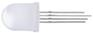|
|6|电阻|碳膜色环 1/4W 1% 220R 编带|10||
|7|电阻|碳膜色环 1/4W 1% 1K 编带|10||
|8|电阻|碳膜色环 1/4W 1% 10K 编带|10||
|9|电阻|碳膜色环 1/4W 1% 100K 编带|10||
|10|电解电容|100UF 16V 5*11MM 插件|10|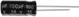|
|11|电解电容|220UF 35V 8*12MM 插件|10|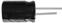|
|12|按键帽|A24 白帽(12*12*7.3)圆|1|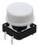|
|13|按键帽|A24 红帽(12*12*7.3)圆|1|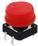|
|14|按键帽|A24 蓝帽(12*12*7.3)圆|1|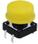|
|15|按键帽|A24 黄帽(12*12*7.3)圆|1|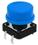|
|16|轻触按键|12*12*7.3MM 插件|4||
|17|蜂鸣器|有源 12*9.5MM 5V 普通分体 2300Hz|1||
|18|遥控器|JMP-1 17键86*40*6.5MM 黑色|1|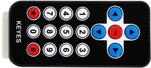|
|19|光敏电阻|5516 亮电阻5-10KΩ 暗电阻0.2MΩ|3||
|20|传感器元件|红外接收 VS1838B|1|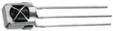|
|21|滚珠开关|HDX-2801 两脚一样|1|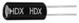|
|22|数码管|一位0.56英寸共阴红|1|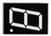|
|23|LCD|1602 COB 5V 蓝屏（一个电阻）|1|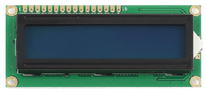|
|24|可调电位器|3386 MU 103（三针直排）|2||
|25|keyes传感器|keyes 人体红外热释电传感器(焊盘孔) 红色 环保|1|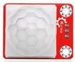|
|26|keyes传感器|keyes DHT11温湿度传感器(焊盘孔) 红色 环保|1|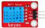|
|27|keyes传感器|keyes 超声波传感器(焊盘孔) 红色 环保|1|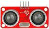|
|28|排针|1*40直针 黑色 2.54|1|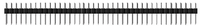|
|29|面包板|ZY-60 400孔白色（纸卡包装）|1|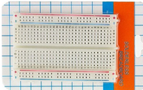|
|30|面包线|面包板连接线30根|1||
|31|杜邦线|母对母20CM/40P/2.54/10股铜包铝 24号线BL|0.5|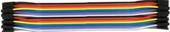|
|32|杜邦线|公对母20CM/40P/2.54/10股铜包铝 24号线BL|0.5|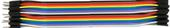|
|33|杜邦线|公对公20CM/40P/2.54/10股铜包铝 24号线BL|0.5|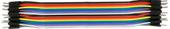|
|34|电阻卡|100*70MM|1||

