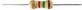
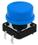
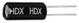
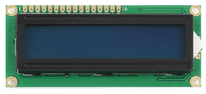
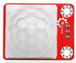
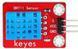
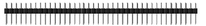
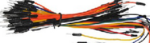
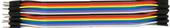

.. _2、清单:

2、清单
=======

.. container:: table-wrapper

   +------+-------------+----------------------------------------------+------+-----------+
   | 编码 | 名称        | 描述                                         | 数量 | 图片      |
   +======+=============+==============================================+======+===========+
   | 1    | LED         | F5-红发红-短                                 | 3    | |image35| |
   +------+-------------+----------------------------------------------+------+-----------+
   | 2    | LED         | F5-黄发黄-短                                 | 3    | |image36| |
   +------+-------------+----------------------------------------------+------+-----------+
   | 3    | LED         | F5-蓝发蓝-短                                 | 3    | |image37| |
   +------+-------------+----------------------------------------------+------+-----------+
   | 4    | LED         | F5-绿发绿-短                                 | 3    | |image38| |
   +------+-------------+----------------------------------------------+------+-----------+
   | 5    | LED         | 10MM乳白 共阳RGB                             | 1    | |image39| |
   +------+-------------+----------------------------------------------+------+-----------+
   | 6    | 电阻        | 碳膜色环 1/4W 1% 220R 编带                   | 10   | |image40| |
   +------+-------------+----------------------------------------------+------+-----------+
   | 7    | 电阻        | 碳膜色环 1/4W 1% 1K 编带                     | 10   | |image41| |
   +------+-------------+----------------------------------------------+------+-----------+
   | 8    | 电阻        | 碳膜色环 1/4W 1% 10K 编带                    | 10   | |image42| |
   +------+-------------+----------------------------------------------+------+-----------+
   | 9    | 电阻        | 碳膜色环 1/4W 1% 100K 编带                   | 10   | |image43| |
   +------+-------------+----------------------------------------------+------+-----------+
   | 10   | 电解电容    | 100UF 16V 5*11MM 插件                        | 10   | |image44| |
   +------+-------------+----------------------------------------------+------+-----------+
   | 11   | 电解电容    | 220UF 35V 8*12MM 插件                        | 10   | |image45| |
   +------+-------------+----------------------------------------------+------+-----------+
   | 12   | 按键帽      | A24 白帽(12\ *12*\ 7.3)圆                    | 1    | |image46| |
   +------+-------------+----------------------------------------------+------+-----------+
   | 13   | 按键帽      | A24 红帽(12\ *12*\ 7.3)圆                    | 1    | |image47| |
   +------+-------------+----------------------------------------------+------+-----------+
   | 14   | 按键帽      | A24 蓝帽(12\ *12*\ 7.3)圆                    | 1    | |image48| |
   +------+-------------+----------------------------------------------+------+-----------+
   | 15   | 按键帽      | A24 黄帽(12\ *12*\ 7.3)圆                    | 1    | |image49| |
   +------+-------------+----------------------------------------------+------+-----------+
   | 16   | 轻触按键    | 12\ *12*\ 7.3MM 插件                         | 4    | |image50| |
   +------+-------------+----------------------------------------------+------+-----------+
   | 17   | 蜂鸣器      | 有源 12*9.5MM 5V 普通分体 2300Hz             | 1    | |image51| |
   +------+-------------+----------------------------------------------+------+-----------+
   | 18   | 遥控器      | JMP-1 17键86\ *40*\ 6.5MM 黑色               | 1    | |image52| |
   +------+-------------+----------------------------------------------+------+-----------+
   | 19   | 光敏电阻    | 5516 亮电阻5-10KΩ 暗电阻0.2MΩ                | 3    | |image53| |
   +------+-------------+----------------------------------------------+------+-----------+
   | 20   | 传感器元件  | 红外接收 VS1838B                             | 1    | |image54| |
   +------+-------------+----------------------------------------------+------+-----------+
   | 21   | 滚珠开关    | HDX-2801 两脚一样                            | 1    | |image55| |
   +------+-------------+----------------------------------------------+------+-----------+
   | 22   | 数码管      | 一位0.56英寸共阴红                           | 1    | |image56| |
   +------+-------------+----------------------------------------------+------+-----------+
   | 23   | LCD         | 1602 COB 5V 蓝屏（一个电阻）                 | 1    | |image57| |
   +------+-------------+----------------------------------------------+------+-----------+
   | 24   | 可调电位器  | 3386 MU 103（三针直排）                      | 2    | |image58| |
   +------+-------------+----------------------------------------------+------+-----------+
   | 25   | keyes传感器 | keyes 人体红外热释电传感器(焊盘孔) 红色 环保 | 1    | |image59| |
   +------+-------------+----------------------------------------------+------+-----------+
   | 26   | keyes传感器 | keyes DHT11温湿度传感器(焊盘孔) 红色 环保    | 1    | |image60| |
   +------+-------------+----------------------------------------------+------+-----------+
   | 27   | keyes传感器 | keyes 超声波传感器(焊盘孔) 红色 环保         | 1    | |image61| |
   +------+-------------+----------------------------------------------+------+-----------+
   | 28   | 排针        | 1*40直针 黑色 2.54                           | 1    | |image62| |
   +------+-------------+----------------------------------------------+------+-----------+
   | 29   | 面包板      | ZY-60 400孔白色（纸卡包装）                  | 1    | |image63| |
   +------+-------------+----------------------------------------------+------+-----------+
   | 30   | 面包线      | 面包板连接线30根                             | 1    | |image64| |
   +------+-------------+----------------------------------------------+------+-----------+
   | 31   | 杜邦线      | 母对母20CM/40P/2.54/10股铜包铝 24号线BL      | 0.5  | |image65| |
   +------+-------------+----------------------------------------------+------+-----------+
   | 32   | 杜邦线      | 公对母20CM/40P/2.54/10股铜包铝 24号线BL      | 0.5  | |image66| |
   +------+-------------+----------------------------------------------+------+-----------+
   | 33   | 杜邦线      | 公对公20CM/40P/2.54/10股铜包铝 24号线BL      | 0.5  | |image67| |
   +------+-------------+----------------------------------------------+------+-----------+
   | 34   | 电阻卡      | 100*70MM                                     | 1    | |image68| |
   +------+-------------+----------------------------------------------+------+-----------+

.. |image1| image:: media/1eba37a568de56317c9b9a59738e76ee.png
.. |image2| image:: media/c871ecd95ce2be359e1ac2babcfcfaeb.png
.. |image3| image:: media/88d6bec911781d5e62b2e2080e5df93e.png
.. |image4| image:: media/fb6f7a17d1cd0704124dd36063ef06bd.png
.. |image5| image:: media/ddadb7881228c58f0e0fcdd0380ed68b.jpg

.. |image10| image:: media/21886581bcce7e7f1198116ed5de42dc.jpg
.. |image11| image:: media/48cfe7faed32a1113ff0e4bde3de1487.jpg
.. |image12| image:: media/7f94aded9f45d50e15c2e6281a1bebe3.jpg
.. |image13| image:: media/f4522a2209f122d0b094cb5e4755b211.jpg
.. |image14| image:: media/0d34492b10fc29699d3b4a1ac7763e7d.jpg

.. |image17| image:: media/5a749ec6435e3982bf4dbdc5eaf7b51e.jpg
.. |image18| image:: media/ab057e99cf396a0688eaa3927951ef8d.jpg
.. |image19| image:: media/c09cb519c3304d4c23eb6c479657c4d0.jpg
.. |image20| image:: media/d6abf05eebac06b01165b65ee5ad0fc3.jpg

.. |image22| image:: media/7787953ef7619ae3753a3324751ceffc.jpg

.. |image24| image:: media/6d6025bc96667b6f44070355f2041f13.jpg

.. |image27| image:: media/8273dc82869fd378e7cfaea91ace60f5.jpg

.. |image29| image:: media/5b59c759d98d3d24894a09e0ac878717.png

.. |image31| image:: media/9f5052e88a31bc42e932c08eaddc049b.jpg

.. |image33| image:: media/8557dbac75e19633c3546ad39b5c66ec.jpg
.. |image34| image:: media/93852b245f0ae356fac222dadb3dbe24.jpg
.. |image35| image:: media/1eba37a568de56317c9b9a59738e76ee.png
.. |image36| image:: media/c871ecd95ce2be359e1ac2babcfcfaeb.png
.. |image37| image:: media/88d6bec911781d5e62b2e2080e5df93e.png
.. |image38| image:: media/fb6f7a17d1cd0704124dd36063ef06bd.png
.. |image39| image:: media/ddadb7881228c58f0e0fcdd0380ed68b.jpg

.. |image44| image:: media/21886581bcce7e7f1198116ed5de42dc.jpg
.. |image45| image:: media/48cfe7faed32a1113ff0e4bde3de1487.jpg
.. |image46| image:: media/7f94aded9f45d50e15c2e6281a1bebe3.jpg
.. |image47| image:: media/f4522a2209f122d0b094cb5e4755b211.jpg
.. |image48| image:: media/0d34492b10fc29699d3b4a1ac7763e7d.jpg

.. |image51| image:: media/5a749ec6435e3982bf4dbdc5eaf7b51e.jpg
.. |image52| image:: media/ab057e99cf396a0688eaa3927951ef8d.jpg
.. |image53| image:: media/c09cb519c3304d4c23eb6c479657c4d0.jpg
.. |image54| image:: media/d6abf05eebac06b01165b65ee5ad0fc3.jpg

.. |image56| image:: media/7787953ef7619ae3753a3324751ceffc.jpg

.. |image58| image:: media/6d6025bc96667b6f44070355f2041f13.jpg

.. |image61| image:: media/8273dc82869fd378e7cfaea91ace60f5.jpg

.. |image63| image:: media/5b59c759d98d3d24894a09e0ac878717.png

.. |image65| image:: media/9f5052e88a31bc42e932c08eaddc049b.jpg

.. |image67| image:: media/8557dbac75e19633c3546ad39b5c66ec.jpg
.. |image68| image:: media/93852b245f0ae356fac222dadb3dbe24.jpg
