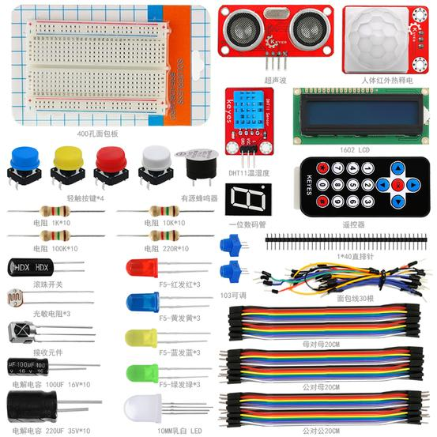

Arduino电子迷基础元件包套件501A

.. _1、说明:

1、说明
=======

这个套件包含我们玩单片机时使用到的常用元件，如不同阻值的电阻、不同颜色的LED灯、红外遥控、传感器、显示器等。它适用于各种单片机和树莓派。我们还会根据这些元件，提供一些基于Arduino开发板的一些学习课程，如LED闪烁实验、红外控灯实验、红外测距实验、温湿度检测实验等，让你对这些电子元件和Arduino开发板有个初步的了解。
